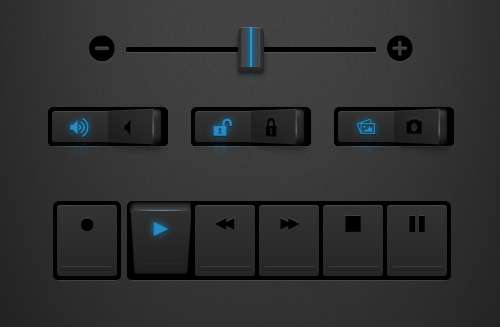

## [Demo](http://simurai.github.io/umbrUI/)

__umbrUI__ is a little experiment trying to style HTML elements with CSS3 only. There are: No images, no extra markup and no JavaScript. Use the toggle to turn the styling on/off.

### Browser support:
WebKit. -> Uses `appearance: none`.